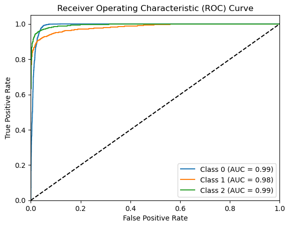

# GSOC 2023 Task

This repository contains code for the task of GSoC 2023 Projects Related To DEEPLENSE to build various image classification models for classifying images into lenses using Keras and Transformers (Keras and PyTorch). The models were evaluated using multilabel ROC-AUC Score (both OVO and OVR) on the test data.

## 1. Common Task: Build a model for classifying images into lenses using Keras

Four different models were trained and evaluated:

1. Simple CNN
2. Fine-tuned Xception
3. Fine-tuned DenseNet
4. Fine-tuned ResNet50 (Transfer Learning)

**ROC-AUC Scores:**

- Simple CNN: 0.5 (not learning)
- ResNet50: 0.988
- Xception: 0.982
- DenseNet: 0.977

The weights for these models are saved under the `model_weights` folder for reproducibility. Additionally, the training history for the best model (ResNet50) is plotted.

 Resnet50 Model result 

 Resnet50 Model history 

See details for data preprocessing and other models under [Commontask1 notebook](commontask1.ipynb)

## 2. Specific Test V: Exploring Transformers

Three vision transformer methods were used to build robust and efficient models for binary classification:

### 2.1 Keras Implementation (vit-keras)

Google's original ViT-base-16 was used as the base model and fine-tuned on the data after preprocessing. The model achieved a 100% test ROC-AUC score, and its training history is plotted.

**Keras Model Weights:**
[Download from Dropbox](https://www.dropbox.com/s/0oxl3jmm8ybwxbw/vitb16_weights.h5?dl=0)

 VIT-16 Model result 

 VIT-16 Model training history 

See details for data preprocessing under [TaskV keras](taskV_Keras.ipynb)

### 2.2 PyTorch Implementation (Hugging Face's Transformers)

Two methods were implemented using Hugging Face's Transformers:

1. Google's ViT-base-16 variation (smaller size)
2. Microsoft's BEIT base-16

**ROC-AUC Scores:**

- Google's ViT-base-16 (HF): 98%
- Microsoft's BEIT base-16: 99%

The training history of loss and AUC scores were plotted for both models.

**Model Weights:**

- BEIT base-16: [Download](https://www.dropbox.com/scl/fo/48vgmsln6rhfc33e0adz5/h?dl=0&rlkey=eb217bnirahkjivj3bgys0u7i)
- Google's ViT-base-16 (HF): [Download](https://www.dropbox.com/scl/fo/pb5yn9z64s7hlrt6x7ktf/h?dl=0&rlkey=kdiqsk5sfw3yigbsvmalbpm88)

 BEIT Model result 

 BEIT Model Trianing History 

See details for data preprocessing under [TaskV HuggingFace/TorchVision](taskV_HF.ipynb)

**Note:** The models are too large to save in the Git repository. The Dropbox links provided can be used to download and test the models, or you can review the output in the provided notebooks.
